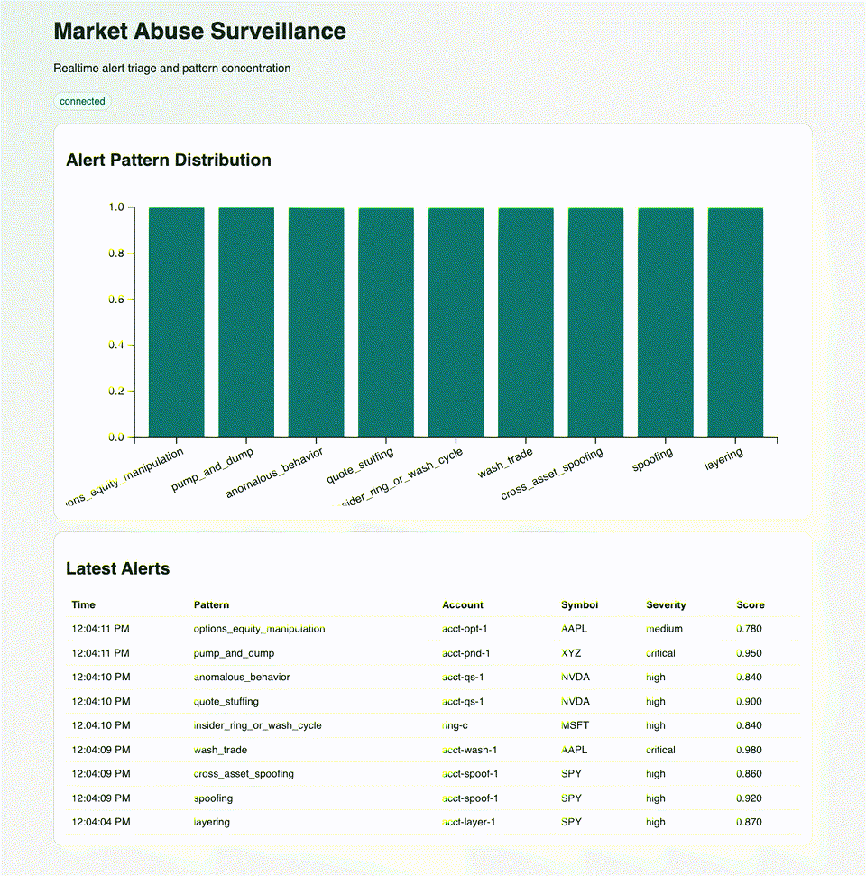

# Intelligent Trade Surveillance & Market Abuse Detection

**Beta / evaluation only - not certified for regulatory compliance use.**

AI-assisted surveillance platform for spoofing, layering, wash trading, quote stuffing, pump-and-dump, pre-announcement trading, cross-asset spoofing, and options-equity manipulation.

## What Evaluators Get
- Real-time API + WebSocket alert feed.
- Hybrid detection stack: rules + unsupervised ML ensemble.
- Tenant isolation with JWT auth + API keys.
- Investigation workflow: cases, evidence, prioritization.
- Reporting exports: SAR markdown and MAR XML.
- Audit-chain verification endpoint.

## One-Command Demo (No External Signups)
```bash
make demo
```

This starts:
- API at `http://localhost:8000`
- Frontend at `http://localhost:5173`
- Local Postgres, Redis, Kafka (Redpanda), Neo4j
- Automatic synthetic event seeding via `scripts/simulate.py`

Stop demo:
```bash
make demo-down
```

## Hosted Demo (Free Tier)
- Public URL: `https://juy595711--trade-surveillance-ai-fastapi-app.modal.run`
- Health: `GET /health`
- Notes: demo runs with `DEMO_MODE=true` and `REQUIRE_API_KEY=false` for frictionless evaluation.

## Demo Preview


## API Quickstart (Tenant + API Key Flow)
1. Register:
```bash
curl -sX POST http://localhost:8000/auth/register \
  -H "Content-Type: application/json" \
  -d '{"email":"eval@example.com","password":"EvalPass!12345"}'
```

2. Get JWT:
```bash
TOKEN=$(curl -sX POST http://localhost:8000/auth/token \
  -H "Content-Type: application/json" \
  -d '{"email":"eval@example.com","password":"EvalPass!12345"}' | jq -r '.access_token')
```

3. Create API key:
```bash
API_KEY=$(curl -sX POST http://localhost:8000/auth/api-keys \
  -H "Authorization: Bearer $TOKEN" \
  -H "Content-Type: application/json" \
  -d '{"name":"institution-a"}' | jq -r '.api_key')
```

4. Ingest an event:
```bash
curl -sX POST http://localhost:8000/events \
  -H "Content-Type: application/json" \
  -H "x-api-key: $API_KEY" \
  -d '{
    "event_id":"evt-1",
    "ts":"2026-02-25T12:00:00Z",
    "venue":"SIM",
    "asset_class":"equity",
    "symbol":"AAPL",
    "account_id":"acct-1",
    "side":"BUY",
    "event_type":"new_order",
    "order_id":"ord-1",
    "quantity":100,
    "price":190,
    "order_type":"LIMIT",
    "metadata":{}
  }'
```

5. Fetch alerts:
```bash
curl -s http://localhost:8000/alerts -H "x-api-key: $API_KEY"
```

## Core Endpoints
- `POST /auth/register`
- `POST /auth/token`
- `POST /auth/api-keys`
- `GET /auth/api-keys`
- `POST /events`
- `GET /alerts`
- `GET /alerts/{alert_id}/priority`
- `POST /cases`
- `GET /cases`
- `GET /cases/{case_id}/evidence`
- `GET /reports/sar/{case_id}`
- `GET /reports/mar/{case_id}`
- `GET /audit/verify`
- `GET /health`
- `GET /metrics`
- `WS /ws/alerts`

## Postman
Import:
- `postman/trade-surveillance-ai.postman_collection.json`

## Legal
- License: `LICENSE`
- Evaluation terms: `TERMS.md`

## Development
```bash
make install
make test
make lint
make backtest
make load
```

## Environment
Use `.env.example` as template.  
For local demo mode:
- `DEMO_MODE=true`
- `REQUIRE_API_KEY=false`

For institutional evaluation mode:
- `DEMO_MODE=false`
- `REQUIRE_API_KEY=true`
